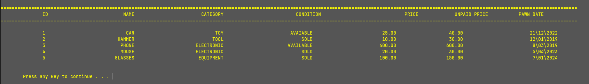

# Pawnshop Inventory Management System

A console-based application designed to efficiently manage the inventory of a pawnshop. This system allows users to add, edit, search, and delete items in the inventory using C and basic file handling.

## Important Announcement 🚨🚨
In late 2024, I intend to rebuild this project using C# .NET with a user-friendly UI. Stay tuned for further updates!

## Project Details

- **Course**: First Semester Project
- **Language**: C
- **Concepts**: File handling, basic data structures

## 🚀 Features

- **Add New Items** 🆕: Easily add new items with details like ID, name, category, condition, price, and date of pawn.
- **Edit Existing Items** ✏️: Modify item details based on their name to keep the inventory up-to-date.
- **Delete Items** 🗑️: Remove items from the inventory, with checks to prevent deletion of sold items.
- **Search Items** 🔍: Find items by name, date of pawn, or within a specific price range.
- **Category Display** 📂: View items grouped by their categories, such as Toys, Furniture, Decorations, Devices, and Tools.
- **Price Range Search** 💲: Identify items within a specified price range.
- **Date Search** 📅: Locate items based on their pawn date.

If you need additional details or a different focus, please let me know!

## 📸 Screenshots:

<div style="text-align: center;">

### 🏠 Main View:


### 📦 All items View:


### 🔍 Search View:


### 🗂️ Search using category:


## 🛠️ How to Run

### Prerequisites

- A C compiler (e.g., GCC)
- Windows OS (for console-specific functions like `SetConsoleCursorPosition`)

### Installation

1. **Clone the Repository**: 
    ```bash
    git clone https://github.com/yourusername/Pawnshop-Inventory-Management-System.git
    ```
2. **Navigate to the Project Directory**:
    ```bash
    cd Pawnshop-Inventory-Management-System
    ```
3. **Compile the Code**:
    ```bash
    gcc -o pawnshop_inventory main.c
    ```
4. **Run the Application**:
    ```bash
    ./pawnshop_inventory
    ```

I've noticed an issue with correctly displaying the data from the file, and I will work on fixing it.

📮 Enjoy!
